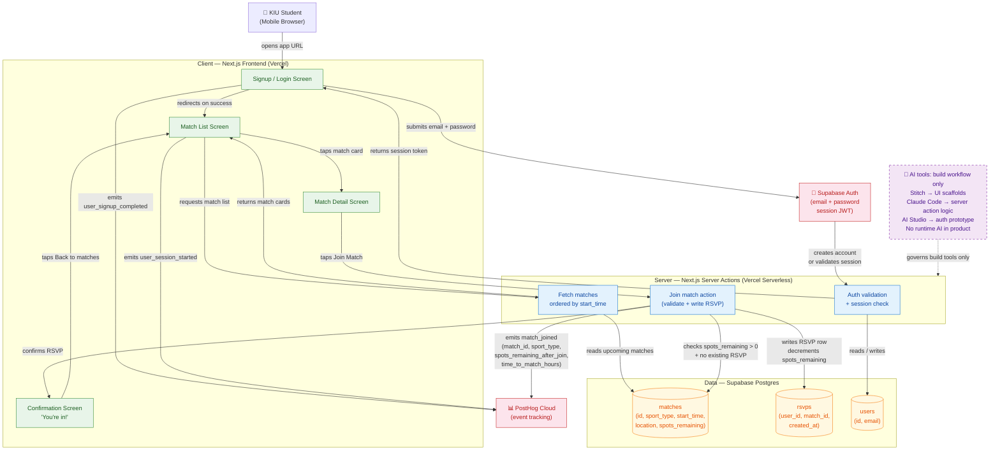

# Architecture Diagram — Source

**Final required file:** `03-build/architecture/architecture-diagram.png`
**Team:** TheMergeConflicters
**Product:** KIU Sports Tracker
**Date:** 24 April 2026

> This file contains the Mermaid source for the architecture diagram. Export the diagram below to PNG using the [Mermaid Live Editor](https://mermaid.live), paste the code, and save the PNG as `architecture-diagram.png` in this folder.

---

## 1. Diagram Goal

```text
This diagram shows how a KIU student signs up, browses matches, and joins one across the Sprint 1 system.
```

---

## 2. Required Boxes Included

| Box | Included | Notes |
|-----|----------|-------|
| User | Yes | Mobile browser entry point |
| Browser / client app | Yes | Next.js frontend |
| Frontend application | Yes | Next.js App Router |
| Authentication provider | Yes | Supabase Auth |
| Backend / server logic | Yes | Next.js server actions |
| Database | Yes | Supabase Postgres |
| Analytics / event tracking | Yes | PostHog Cloud |
| External APIs or services | Yes | Supabase managed Postgres is the external service |
| AI touchpoints | Yes | Annotated as build-workflow only — no runtime AI |

---

## 3. Mermaid Diagram



---

## 4. Arrow Logic Summary

| Arrow | Label | From | To |
|-------|-------|------|-----|
| User opens URL | opens app URL | User | Signup/Login Screen |
| Signup/login form submit | submits email + password | Signup/Login Screen | Supabase Auth |
| Auth callback | creates account or validates session | Supabase Auth | Auth server action |
| User record read/write | reads / writes | Auth server action | users table |
| Session returned | returns session token | Auth server action | Signup/Login Screen |
| Auth success redirect | redirects on success | Signup/Login Screen | Match List Screen |
| Signup event | emits user_signup_completed | Signup/Login Screen | PostHog |
| Match list request | requests match list | Match List Screen | Fetch matches server action |
| Match read | reads upcoming matches | Fetch matches server action | matches table |
| Match cards returned | returns match cards | Fetch matches server action | Match List Screen |
| Session event | emits user_session_started | Match List Screen | PostHog |
| Match card tap | taps match card | Match List Screen | Match Detail Screen |
| Join tap | taps Join Match | Match Detail Screen | Join match server action |
| RSVP validation read | checks spots_remaining > 0 + no existing RSVP | Join server action | matches table |
| RSVP write | writes RSVP row, decrements spots_remaining | Join server action | rsvps table |
| RSVP confirmed | confirms RSVP | Join server action | Confirmation Screen |
| Activation event | emits match_joined | Join server action | PostHog |
| Back to matches | taps Back to matches | Confirmation Screen | Match List Screen |

---

## 5. AI Annotation

**AI tools exist in the build workflow only. No AI feature runs at product runtime.**

- Stitch: generated UI screen scaffolds (client layer) — code reviewed and annotated before merge
- Claude Code: generated join match server action logic (server layer) — annotated and reviewed per process map
- AI Studio: prototyped auth flow before Supabase integration — output treated as reference, not committed directly
- GitHub Copilot: inline suggestions across layers — each suggestion reviewed before acceptance

---

## 6. Final Export Check

- [x] Boxes match the written system design
- [x] Arrows are labeled
- [x] Database is visually distinct (yellow nodes)
- [x] Auth is shown where it happens (between frontend and Supabase Auth)
- [x] Analytics is shown where events fire (from frontend and server action)
- [x] Diagram is readable at normal zoom
- [x] PNG exported and committed as `architecture-diagram.png`

---

*Architecture Diagram Source | TheMergeConflicters | CS-PD-2026 | Spring 2026*
