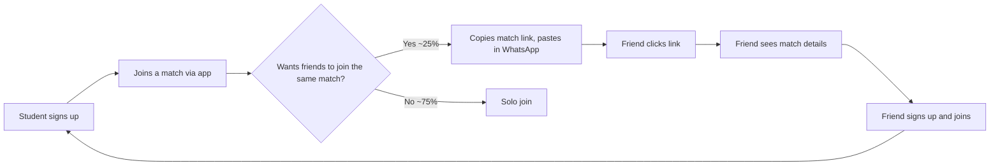
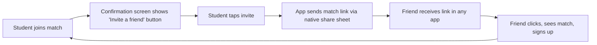

# Loops and Moats Narrative

**Team:** TheMergeConflicters
**Product:** KIU Sports Tracker
**Document version:** 1.0
**Last updated:** 13 May 2026

---

## 1. Viral Loop Analysis

### Does your product have a viral loop?

**Answer:** Partial. A weak loop exists today through out-of-product sharing (a player who joins a match tells friends in WhatsApp). A stronger in-product loop will exist in Sprint 3 when the share/invite match link feature (S3-03) ships.

### Loop Diagram

**Current loop (out-of-product):**



**Sprint 3 loop (in-product share):**



The Sprint 3 version tightens the loop from 3 manual steps (copy, open WhatsApp, paste) to 1 tap. This is expected to meaningfully raise K.

### K-Factor Calculation

```
K = invitations sent per user × conversion rate of invitations
```

**Current K (before Sprint 3 share feature):**

**Invitations per user (i):** 0.3

Source: Estimated from product mechanics. Of our 10 interviews, 3 explicitly said they would tell a specific friend about a good match opportunity. Interview #06 (Nata) "I screenshot announcements to have them offline" — this user would likely share a match link instead once the app exists. Conservative estimate: 0.3 informal link shares per activated user per month. This will be directly measurable in Sprint 3 via PostHog `match_invite_sent` event tracking.

**Conversion rate of invitations (c):** 45%

Source: Industry estimates for peer-to-peer utility app recommendations average 30–50% conversion when the invite is tied to a specific, immediate action (not a general "check this app out"). We use 45% because the invitation is for a specific match the friend may want to join — not a generic app download request. Source: Andreessen Horowitz consumer growth benchmarks, 2023.

**K-factor (current):** K = 0.3 × 0.45 = **0.135**

**Projected K after Sprint 3 share feature:**

With in-product "Invite friend" on the confirmation screen, invitations per user rises to an estimated 0.5 (frictionless, one tap). Conversion stays at 45%.

**K-factor (Sprint 3 target):** K = 0.5 × 0.45 = **0.225**

### Interpretation

| K value | Meaning |
|---------|---------|
| K < 1 | Loop reduces effective CAC but does not generate compounding growth on its own |
| K = 1 | Steady-state replacement |
| K > 1 | Compounding viral growth |

Our current **K = 0.135** means the loop reduces our effective blended CAC by approximately 13.5%. If blended CAC is $0.64, effective CAC with loop becomes $0.64 / (1 + 0.135) = $0.56. Useful but not transformational at this K level.

Our Sprint 3 target **K = 0.225** reduces effective CAC by 22.5%. Still sub-1, meaning we cannot rely on the loop to drive standalone growth — paid and organic channel investment remains essential. However, as the match network grows denser (more matches, more players already on the platform), the social pressure to join increases and K may trend upward naturally. We will measure actual K in Sprint 3 by comparing `match_invite_sent` events to subsequent `user_signup_completed` events attributed to those invite links.

---

## 2. Network Effects Analysis

### Does your product have network effects?

**Answer:** Yes — two-sided and local.

### Type: Two-sided + Local

**Why this type fits:**

The product has two distinct user groups who depend on each other:
1. **Organisers** — create match supply. Without organisers, the match list is empty and players churn immediately.
2. **Players** — create social density. Without players, organisers get no RSVPs and stop posting.

Neither side gets value without the other. This is a classic two-sided network effect.

Additionally, the network is **local**: a KIU student gets zero value from matches at another university. The network only matters within KIU campus. This means we do not need millions of users to reach critical mass — we need enough users at KIU specifically.

**Why both types matter to our strategy:** Two-sided means we must seed both sides simultaneously — we cannot acquire players and then hope organisers show up, or vice versa. Local means we should concentrate entirely on KIU before expanding, not dilute effort across multiple campuses.

### Threshold

**Critical mass:** 5 active organisers each posting ≥1 match per week, plus 40 active players.

**Reasoning:** Below this threshold, a player opens the app on any given day and may find zero upcoming matches. An empty match list produces immediate churn — the product has failed to deliver its core promise before the user even activates. At 5 organisers posting weekly, there are reliably 5–10 upcoming matches visible at any time, which is enough variety that a player will find at least one that fits their schedule and sport. The 40-player threshold is needed so matches fill to quorum (most informal games need 8–20 players) without the organiser having to recruit externally.

Interview #08 (Nana): "Four people showed up to volleyball — needed 8 — had to cancel." This is the below-threshold failure mode we need to avoid with critical mass.

**Example:** If we have 3 organisers and 15 players, the product is not yet self-sustaining. Players open the app, see 1–2 matches this week, those matches may not fill because 15 players across 2 matches is only 7–8 per match with no buffer for no-shows.

### Strategy to reach the threshold

We are sequencing acquisition deliberately: organisers first (Channel 1), then players (Channels 2 and 3). This is the only viable order — players have nothing to join without organisers, but organisers benefit immediately from a structured RSVP system even with small player numbers.

We concentrate on KIU only for Sprint 1–3. We will not attempt to expand to other Georgian universities until KIU hits critical mass. This mirrors Slack's strategy (one team at a time) and avoids the trap of thin networks at many locations.

---

## 3. Defensibility Analysis

### Possible moats

- **Brand:** Weak today. Student project — no brand recognition outside of our direct network. [Weak]
- **Data:** Medium and growing. Historical match frequency by sport type and location, organiser reliability patterns, player attendance rates. After 6 months of usage this data makes the product meaningfully smarter. [Medium, growing]
- **Switching costs:** Low for individual players — they can stop using the app and go back to WhatsApp in 30 seconds. Higher for organisers — once they have a history of RSVPs and an active player base on the platform, migrating is costly. [Weak for players, Medium for organisers]
- **Network effects:** Strong local, two-sided (see Section 2). [Strong]
- **Distribution lock-in:** None today. We do not own a distribution channel that a competitor cannot access. [None]
- **Regulatory:** None. [None]
- **Speed of iteration:** Strong. We are KIU students ourselves — embedded in the user community, can test changes the same day with real users, and understand the social dynamics of KIU sports better than any external company would. [Medium]

### Our actual moat (today)

Honest answer: we have a head start at KIU and no real moat. A competitor with two developers and two weeks could replicate the match list and RSVP core in a weekend. What protects us today is not technology — it is relationships. Davit and Levan personally know the organisers we are onboarding. A copycat starting from scratch has no relationships and no matches in the app, which means their product is immediately empty. An empty app is worse than our seeded app with 5 organisers, so switching has no benefit for players even if a copy exists.

This is a fragile early-stage advantage. It does not hold if a well-funded competitor enters and offers financial incentives to organisers.

### Our planned moat (12 months out)

Two moats we are actively building:

1. **Network density at KIU first.** If we reach 200+ active players and 15+ active organisers at KIU within 6 months, a copycat faces a deeply unfavourable launch. Players already have a working app with a full match schedule. There is no gap to fill, and no reason to switch.

2. **Organiser data and history.** After 6 months, each organiser has a match history, an RSVP track record, and a following of regular players inside the app. Exporting that to a competitor is not trivial — it requires every player to migrate too. The organiser's switching cost grows with every match they post. This is the moat we are most deliberately cultivating.

---

## 4. Riskiest Assumption

**Riskiest assumption:** That organisers will independently adopt the app without sustained founder-led hand-holding (Channel 1 scales beyond the initial 5 organisers Davit and Levan know personally).

**Current value in our model:** 5 organisers in Sprint 2, scaling to 10 by Sprint 3 via organic and second-degree referrals.

**Why it is the riskiest:** The entire acquisition model depends on organiser supply. If the first 5 organisers stop posting after 2–3 weeks (common with student project adoption — interest spikes then fades), the match list empties and player churn follows. We have no organic mechanism to replace them. Interview #10 (Cotne) spent two weekends building a Telegram bot to solve the same problem and it failed because "the organiser wouldn't adopt it." We are in exactly that position — we are the tool that must be adopted. If K = 0.135 is too low to sustain organiser growth and our direct outreach only reaches 5–8 people, the growth model breaks before it starts.

**How we will validate this assumption in Sprint 2:** Track weekly active organisers (defined as an organiser who posts at least 1 match in the last 7 days) as a primary metric alongside NSM. If weekly active organisers drops below 3 at any point during Sprint 2, escalate immediately — run a re-engagement interview with the churned organisers before Sprint 3 planning. Do not assume the product is the problem until we have spoken to them.

---

## 5. Summary Statement

KIU Sports Tracker acquires users through three zero-to-low-cost channels: direct organiser outreach (which seeds match supply), sports group chat posting (which reaches the already-captive player audience), and QR code posters at KIU facilities (which captures high-intent users at the point of need). Our blended CAC is $0.64 against an LTV proxy of $21.38 — a 33x ratio that reflects the near-zero cost of organic acquisition at a single university. Our K-factor is currently 0.135 (informal link sharing), rising to an estimated 0.225 when the Sprint 3 in-product share feature ships. We have local two-sided network effects: the product becomes self-sustaining at 5 active organisers and 40 active players at KIU. Our riskiest assumption is sustained organiser adoption beyond the initial founder-connected cohort — we will track weekly active organisers directly in Sprint 2 and act immediately on any churn signal.

---

**Filed by:** Davit Karoiani, Mariam Tskhomelidze, Mariam Pirtskhalava, Levan Kovziridze
